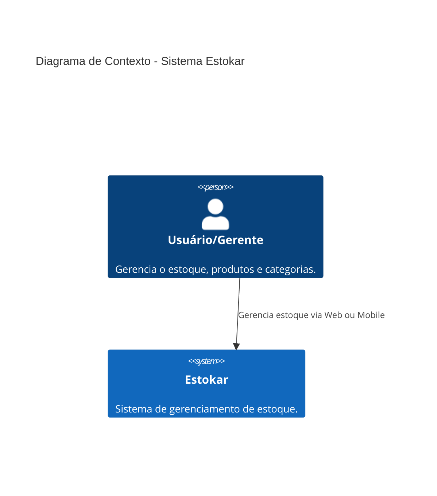
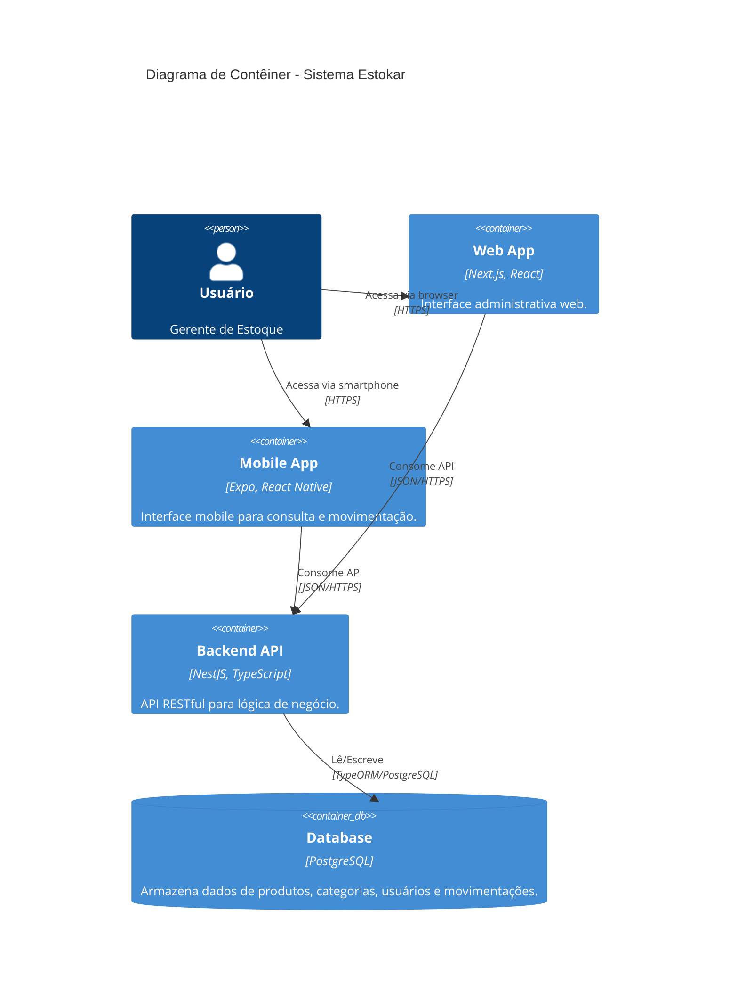
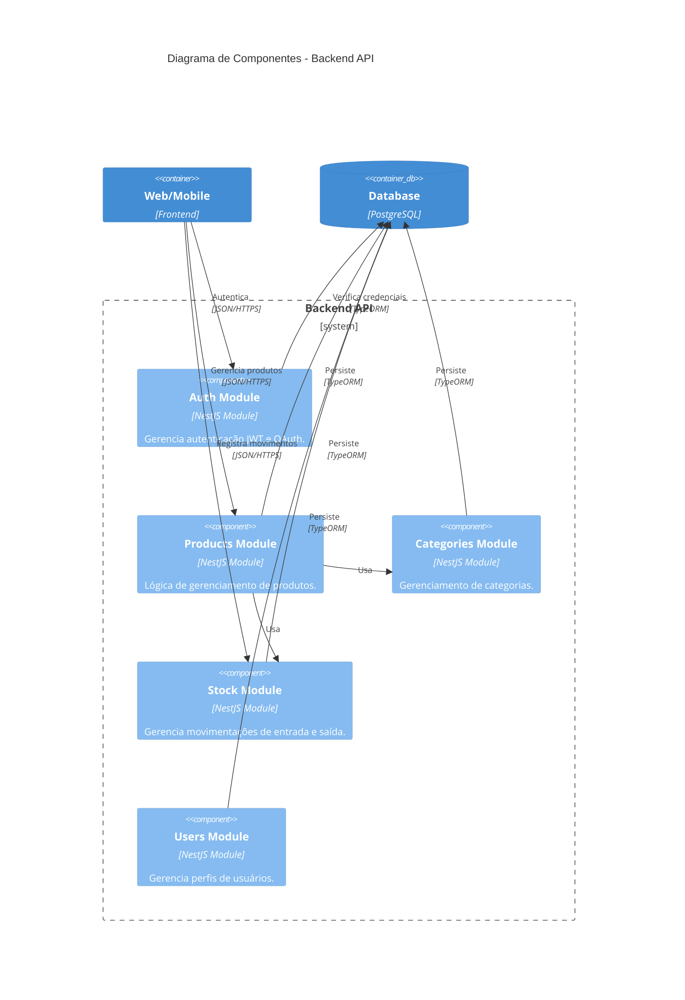

# Arquitetura do Projeto Estokar

Este documento descreve a arquitetura do sistema Estokar utilizando o modelo C4 para visualização.

## 1. Diagrama de Contexto de Sistema
O diagrama de contexto mostra como o sistema Estokar interage com os usuários.

## 2. Diagrama de Contêiner
O diagrama de contêiner mostra as tecnologias e como elas se comunicam.

## 3. Diagrama de Componentes (Backend)
Detalhamento dos componentes internos do Backend.

